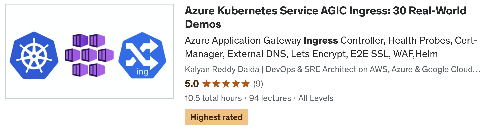

# [Azure Kubernetes Service AGIC Ingress: 30 Real-World Demos](https://stacksimplify.com/courses/azure-aks-agic/)

## [Course Details](https://stacksimplify.com/courses/azure-aks-agic/)
- **Title:** [Azure Kubernetes Service AGIC Ingress: 30 Real-World Demos](https://stacksimplify.com/courses/azure-aks-agic/)
- **Sub Title:** Ingress URL & Domain Routing, Health Probes, Helm, Cert-Manager, External DNS, Lets Encrypt, E2E SSL, WAF, Rewrite Rules

## [Course Modules](https://stacksimplify.com/courses/azure-aks-agic/)
01. AGIC Install Greenfield
02. AGIC Default Backend
03. AGIC Ingress Paths
04. AGIC Ingress URLRouting
05. AGIC Backend Path Prefix
06. AGIC Backend Hostname
07. AGIC Cookie-based Affinity
08. AGIC Override Frontend Port
09. AGIC Rewrite Rule Set
10. AGIC Probes Default and HTTP
11. AGIC Probes Readniess Liveness
12. AGIC Probes Annotations
13. Delegate Domain from AWS Route53 to Azure DNS Zones
14. ExternalDNS for AzureDNS on AKS
15. AGIC ExternalDNS Basic
16. AGIC Domain Name Routing
17. AGIC Ingress TLS
18. AGIC SSL Redirect
19. AGIC Upload SSLCert Application Gateway
20. AGIC Backend SSL Application
21. AGIC End2End SSL
22. AGIC SSL with LetsEncrypt
23. AGIC WAF OWASP
24. AGIC WAF Policy
25. AGIC Private IP
26. AGIC and Nginx Ingress
27. AGIC Install using Helm
28. AGIC Shared Application Gateway
29. AGIC Watch Namespaces

## [What will students learn in your course?](https://stacksimplify.com/courses/azure-aks-agic/)
- You will master each and every Ingress concept on Azure Application Gateway Ingress Controller (AGIC) with 30+ Real-World Demos
- You will implement Path based and Domain based Routing using Ingress Service
- You will implement 5 demos for Health Probes in combination with Ingress Annotations, Readiness, liveness probes
- You will install External DNS and implement automatic addition of DNS records in Azure DNS Zones
- You will implement automatic provisioning of production grade SSL Certificates using Cert-Manager and Lets Encrypt
- You will implement 6 demos on Ingress SSL which includes SSL TLS, End to End SSL and many more. 
- You will implement Azure Web Application Firewall usecases in combination with Ingress Service
- You will use Helm CLI to install Azure Application Gateway Ingress Controller (AGIC) on Azure AKS Cluster
- You will implement a Shared Azure Application Gateway concept with a practical demo
- You will implement Azure Application Gateway Ingress Controller (AGIC) Watch Namespaces concept with 2 practical demos. 
- You will also implement Ingress important concepts cookie based affinity, backend path prefix, backend hostname, override frontend ports and Rewrite Rule sets

## [What are the requirements or prerequisites for taking your course?](https://stacksimplify.com/courses/azure-aks-agic/)
- You must have Kubernetes knowledge and experience to follow with me for hands-on activities.

## [Who is this course for?](https://stacksimplify.com/courses/azure-aks-agic/)
- This course is designed for students who have completed my Azure Kubernetes Service with Azure DevOps and Terraform course
- Infrastructure Architects or Sysadmins or Developers or DevOps Engineers who are planning to master Internet Edge traffic for Azure AKS Clusters using Load Balancers

## [Github Repositories used for this course](https://stacksimplify.com/courses/azure-aks-agic/)
- [azure-kubernetes-service-agic](https://github.com/stacksimplify/azure-kubernetes-service-agic)
- [Course Presentation](https://github.com/stacksimplify/azure-kubernetes-service-agic/tree/main/course-presentation)
- **Important Note:** Please go to these repositories and FORK these repositories and make use of them during the course.

## [Each of my courses come with](https://stacksimplify.com/courses/azure-aks-agic/)
- Amazing Hands-on Step By Step Learning Experiences
- Practical demos for each and every concept
- Friendly Support in the Q&A section
- "30-Day "No Questions Asked" Money Back Guaranteed by Udemy"

## My Other AWS Courses
- [Udemy Enroll](https://www.stacksimplify.com/azure-aks/courses/stacksimplify-best-selling-courses-on-udemy/)

## Instructor Profile
- [Kalyan Reddy Daida - StackSimplify](https://stacksimplify.com/about/)

# HashiCorp Certified: Terraform Associate - 50 Practical Demos
 

# AWS EKS - Elastic Kubernetes Service - Masterclass

# Azure Kubernetes Service with Azure DevOps and Terraform 

# Terraform on AWS with SRE & IaC DevOps | Real-World 20 Demos

# Azure - HashiCorp Certified: Terraform Associate - 70 Demos

# Terraform on Azure with IaC DevOps and SRE | Real-World 25 Demos

# [Terraform on AWS EKS Kubernetes IaC SRE- 50 Real-World Demos](https://stacksimplify.com/courses/terraform-aws-eks/)

# [Helm Masterclass: 50 Practical Demos for Kubernetes DevOps](https://stacksimplify.com/courses/helm-masterclass/)

---

## My Other Courses (383,000+ Students, 20 Courses)

> All courses available at [stacksimplify.com/courses](https://stacksimplify.com/courses/)

### AWS Courses

| Course | Students | Rating |
|--------|----------|--------|
| [AWS EKS Kubernetes Masterclass](https://stacksimplify.com/courses/aws-eks-masterclass/) | 70,041+ | 4.6 (5,495 ratings) |
| [AWS VPC Transit Gateway](https://stacksimplify.com/courses/aws-vpc-transit-gateway/) | 52,243+ | 4.6 (790 ratings) |
| [Terraform on AWS with SRE and IaC DevOps](https://stacksimplify.com/courses/terraform-on-aws-sre/) | 31,006+ | 4.6 (3,347 ratings) |
| [Terraform on AWS EKS Kubernetes IaC SRE](https://stacksimplify.com/courses/terraform-aws-eks/) | 26,929+ | 4.5 (2,238 ratings) |
| [HashiCorp Certified: Terraform Associate (AWS)](https://stacksimplify.com/courses/hashicorp-terraform-associate-aws/) | 16,835+ | 4.6 (1,754 ratings) |
| [AWS CloudFormation Simplified](https://stacksimplify.com/courses/aws-cloudformation/) | 16,223+ | 4.3 (1,469 ratings) |
| [AWS Fargate and ECS Masterclass](https://stacksimplify.com/courses/aws-fargate-ecs/) | 15,208+ | 4.4 (1,051 ratings) |
| [AWS CodePipeline CI/CD](https://stacksimplify.com/courses/aws-codepipeline/) | 9,832+ | 4.0 (966 ratings) |
| [AWS Elastic Beanstalk Master Class](https://stacksimplify.com/courses/aws-elastic-beanstalk/) | 7,588+ | 4.3 (373 ratings) |
| [Ultimate DevOps Real-World Project on AWS](https://stacksimplify.com/courses/ultimate-devops-real-world-project-on-aws/) | 4,772+ | 4.72 (358 ratings) |

### Azure Courses

| Course | Students | Rating |
|--------|----------|--------|
| [Azure Kubernetes Service with Azure DevOps and Terraform](https://stacksimplify.com/courses/azure-aks-devops-terraform/) | 48,551+ | 4.6 (6,196 ratings) |
| [Terraform on Azure with IaC DevOps SRE](https://stacksimplify.com/courses/terraform-on-azure/) | 17,918+ | 4.7 (1,911 ratings) |
| [Azure HashiCorp Certified: Terraform Associate](https://stacksimplify.com/courses/hashicorp-terraform-associate-azure/) | 16,938+ | 4.5 (1,985 ratings) |
| [Azure Kubernetes Service AGIC Ingress](https://stacksimplify.com/courses/azure-aks-agic/) | 2,012+ | 4.6 (112 ratings) |

### GCP Courses

| Course | Students | Rating |
|--------|----------|--------|
| [GCP Google Kubernetes Engine GKE with DevOps](https://stacksimplify.com/courses/gcp-gke-kubernetes/) | 8,769+ | 4.4 (779 ratings) |
| [GCP Associate Cloud Engineer Certification](https://stacksimplify.com/courses/gcp-associate-cloud-engineer/) | 6,007+ | 4.6 (599 ratings) |
| [GCP Terraform on Google Cloud](https://stacksimplify.com/courses/gcp-terraform/) | 2,600+ | 4.4 (213 ratings) |
| [GCP GKE Terraform on Google Kubernetes Engine](https://stacksimplify.com/courses/gcp-gke-terraform/) | 2,040+ | 4.6 (155 ratings) |

### DevOps and General

| Course | Students | Rating |
|--------|----------|--------|
| [Helm Masterclass: 50 Practical Demos](https://stacksimplify.com/courses/helm-masterclass/) | 12,069+ | 4.7 (915 ratings) |
| [Docker in a Weekend: 40 Practical Demos](https://stacksimplify.com/courses/docker-weekend/) | 3,802+ | 4.6 (361 ratings) |

---

## Instructor Profile
- [Kalyan Reddy Daida - StackSimplify](https://stacksimplify.com/about/)

---

## Connect with Me
- [YouTube - Cloud & DevOps Tutorials](https://www.youtube.com/@stacksimplify)
- [LinkedIn - Kalyan Reddy](https://www.linkedin.com/in/kalyan-reddy/)
- [GitHub - StackSimplify](https://github.com/stacksimplify)

---

